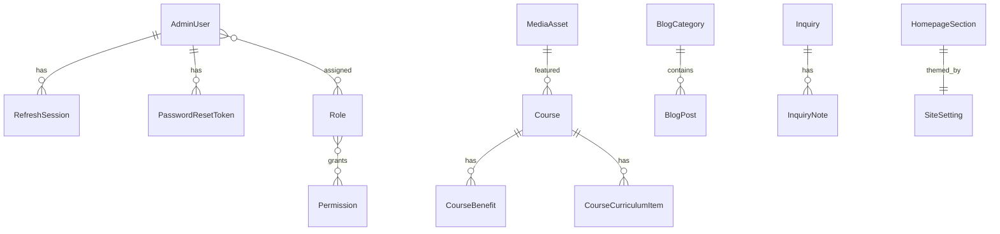

# YogiSpeaks — Database Plan

ORM: **Prisma** · Database: **PostgreSQL** · IDs: **UUID**  
Soft delete via `deletedAt` where content recovery matters.

**Domain boundary:** Coaching CMS + leads only. No tables for packages, destinations, hotels, flights, itineraries, or travel inventories.

---

## 1. Enums

```text
AdminStatus          ACTIVE | INACTIVE
PublishStatus        DRAFT | PUBLISHED
InquiryType          ASSESSMENT | CONTACT
InquiryStatus        NEW | CONTACTED | QUALIFIED | ENROLLED | CLOSED | SPAM
SubscriberStatus     ACTIVE | UNSUBSCRIBED
NavLocation          HEADER | FOOTER_QUICK | FOOTER_PROGRAMS
HomepageSectionKey   HERO | STATS | FEATURES | FAQS | COURSES_FEATURED |
                     TESTIMONIALS | LEARNING_STEPS | BENEFITS | BOTTOM_CTA | NEWSLETTER
RoleCode             SUPER_ADMIN | ADMIN | EDITOR
```

---

## 2. Auth & RBAC

### AdminUser

| Column | Type | Notes |
|--------|------|-------|
| id | uuid PK | |
| email | citext unique | |
| passwordHash | string | Argon2 — never plain |
| fullName | string | |
| status | AdminStatus | |
| failedLoginCount | int | |
| lockedUntil | datetime? | |
| lastLoginAt | datetime? | |
| createdAt / updatedAt | datetime | |
| createdById / updatedById | uuid? | |
| deletedAt | datetime? | |

### Role · Permission · AdminUserRole · RolePermission

- `Role`: code (`SUPER_ADMIN`…), name, description  
- `Permission`: code e.g. `users.manage`, `courses.write`, `settings.write`, `audit.read`  
- Join tables for many-to-many  

### RefreshSession

| Column | Notes |
|--------|-------|
| id | uuid |
| adminUserId | FK |
| tokenHash | refresh token hash only |
| userAgent / ip | optional audit |
| expiresAt | |
| revokedAt | |
| replacedById | rotation chain |

### PasswordResetToken

| Column | Notes |
|--------|-------|
| id | uuid |
| adminUserId | FK |
| tokenHash | raw token never stored |
| expiresAt | short TTL |
| usedAt | single use |
| createdAt | |

### AuditLog

`actorId`, `action`, `entityType`, `entityId`, `metadata` (JSON), `ip`, `userAgent`, `createdAt`.

---

## 3. Site configuration

### SiteSetting

Key-value or single-row JSON document pattern:

**Recommendation:** one logical row group with typed columns **or** `key` + `valueJson` for extensibility. Prefer a **typed `SiteSettings` singleton** for core brand/contact fields + JSON for social links / SEO defaults to keep queries simple.

Core fields mirror CONTENT_MODEL §1 (businessName, colors, fonts, contact, maps, hours, default SEO media IDs).

### NavigationItem

`label`, `href`, `location`, `parentId`, `sortOrder`, `isVisible`, `openInNewTab`, audit fields.

---

## 4. Homepage

### HomepageSection

`key` (unique enum), `eyebrow`, `title`, `subtitle`, `bodyHtml` (sanitized), `primaryCtaLabel`, `primaryCtaHref`, `secondaryCtaLabel`, `secondaryCtaHref`, `mediaId?`, `extraJson` (highlight phrases, quote, etc.), `isVisible`, `sortOrder`.

### HomepageStat

`label`, `value`, `iconKey?`, `sortOrder`, `isVisible`.

### Feature

`title`, `description`, `iconKey` / `iconMediaId`, `sortOrder`, `isVisible`.

### LearningStep

`stepNumber`, `title`, `description`, `iconKey`, `sortOrder`, `isVisible`.

### BenefitItem

`label`, `sortOrder`, `isVisible`.

---

## 5. Courses

### Course

`name`, `slug` (unique), `shortDescription`, `longDescriptionHtml`, `featuredImageId`, `duration`, `mode`, `feeAmount?`, `feeCurrency?`, `feeDisplayEnabled`, `eligibilityHtml`, `whoShouldJoinHtml`, `ctaLabel`, `ctaHref`, SEO fields, `status`, `isFeatured`, `sortOrder`, soft delete, audit.

### CourseBenefit

`courseId`, `label`, `sortOrder`.

### CourseCurriculumItem

`courseId`, `title`, `bodyHtml?`, `sortOrder`.

### CourseGalleryItem (optional)

`courseId`, `mediaId`, `sortOrder`.

---

## 6. Social proof & FAQ

### Testimonial

`studentName`, `studentImageId?`, `designation`, `courseLabel?`, `review`, `rating`, `isGoogleReview`, `reviewUrl?`, `isVisible`, `sortOrder`, soft delete.

### Faq

`question`, `answerHtml`, `category?`, `showOnHomepage`, `isVisible`, `sortOrder`.

---

## 7. Pages & blog

### Page

`title`, `slug` unique, `bodyHtml`, `heroImageId?`, SEO, `status`, soft delete.

### BlogCategory

`name`, `slug` unique, `description?`, `sortOrder`.

### BlogPost

`title`, `slug` unique, `excerpt`, `bodyHtml`, `categoryId`, `authorName`, `featuredImageId?`, SEO, `status`, `publishedAt`, soft delete.

---

## 8. Media

### MediaAsset

`url`, `publicId` / storage key, `provider` (`LOCAL`|`CLOUDINARY`|`S3`), `mimeType`, `byteSize`, `width`, `height`, `alt`, `title`, `caption`, `folder?`, `createdById`, timestamps, soft delete.

---

## 9. Leads & messaging

### Inquiry

Assessment + contact fields from CONTENT_MODEL, `type`, `status`, `sourcePage`, `ipHash?`, `userAgent?`, timestamps, soft delete optional.

### InquiryNote

`inquiryId`, `adminUserId`, `body`, `createdAt`.

### NewsletterSubscriber

`email` unique, `status`, `subscribedAt`, `unsubscribedAt?`, `source?`.

### EmailTemplate

`key` unique, `subject`, `bodyHtml`, `description`, `updatedAt`.

---

## 10. Indexes (planned)

- Unique: `AdminUser.email`, `Course.slug`, `BlogPost.slug`, `Page.slug`, `BlogCategory.slug`, `NewsletterSubscriber.email`, `HomepageSection.key`, `EmailTemplate.key`  
- List filters: `status`, `deletedAt`, `isVisible`, `isFeatured`, `publishedAt`  
- Search: `GIN`/pg trigram or Prisma `contains` on title/name/email for admin tables  
- FK indexes on all relation columns  

---

## 11. Relations summary

```text
AdminUser ──< RefreshSession
AdminUser ──< PasswordResetToken
AdminUser >──< Role >──< Permission
AdminUser ──< AuditLog
AdminUser ──< InquiryNote

Course ──< CourseBenefit
Course ──< CourseCurriculumItem
Course ──< CourseGalleryItem
MediaAsset ← referenced by Course, BlogPost, Page, Testimonial, SiteSettings, etc.

BlogCategory ──< BlogPost
Inquiry ──< InquiryNote
```

Deletion: prefer soft delete for CMS entities; hard-delete unused media only when unreferenced; cascade notes with inquiry policy documented in migrations.

---

## 12. Seed plan

1. Roles + permissions + role bindings  
2. Super-admin from env  
3. Site settings (navy/gold defaults from design system)  
4. Navigation (Home, About, Courses dropdown, Reviews, Blog, Contact) + header CTA  
5. Homepage sections + stats + 6 features + FAQs + 5 courses + sample testimonials + 5 steps + benefits + bottom CTA  
6. Legal page placeholders  
7. Email templates  
8. Sample blog categories + 3 draft/published posts if copy available  

**Never** commit real production passwords.  
**Never** seed travel-package entities.

---

## 13. Migrations & environments

- `prisma migrate dev` locally  
- `prisma migrate deploy` in CI/prod  
- `prisma db seed` after migrate  
- Backup/restore documented in Phase 8 (`DEPLOYMENT.md`)

---

## 14. ER sketch


