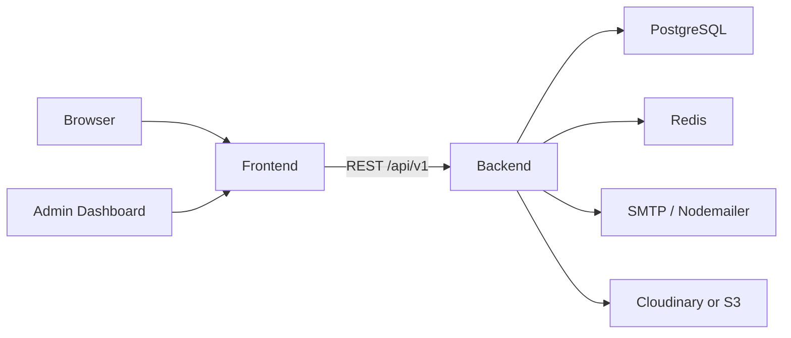
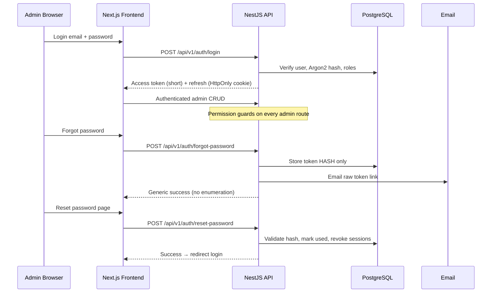

# YogiSpeaks — Implementation Plan (Phase 1)

**Status:** Phase 1 complete — analysis and planning only. No application code yet.  
**Project type:** Communication coaching and course lead-generation platform  
**Business:** Spoken English, IELTS, professional communication, personality development, Spoken Hindi coaching  

---

## 1. Source-of-truth review

| File | Role | Outcome |
|------|------|---------|
| `reference/homepage-reference.jpg` | Primary visual reference | Section order, spacing, typography, CTA styling, cards, dark/light bands |
| `reference/homepage-annotated-reference.jpg` | CTA identification only | Green circles mark CTAs — **not** part of the final UI |
| `reference/logo-primary.png` | Brand identity | Navy / gold / white circular YS emblem; favicon candidate = YS monogram |
| `docs/yogispeaks-technical-requirements.pdf` | Tech & delivery requirements | Next.js + NestJS + PostgreSQL + Prisma + Docker + custom admin CMS |
| `docs/content-required.pdf` | Client content checklist | Lists content the client must supply; used to define seed placeholders |
| `docs/best-technology-stack.pdf` | Stack note (mixed domain) | **Travel / Thomas Cook package features are explicitly excluded** (see §11) |

**Missing from repo (expected later):** `docs/yogispeaks-homepage-content.pdf` — no separate homepage copy PDF was available. Seed copy for Phase 3 will be transcribed from the homepage reference images and replaced when the client supplies final text.

---

## 2. Proposed architecture

Two independently deployable apps under one monorepo:

```
yogispeaks/
├── frontend/          # Next.js App Router — public site + admin UI
├── backend/           # NestJS REST API — /api/v1 — Prisma + PostgreSQL
├── infra/             # Nginx, deploy helpers
├── docs/              # Architecture, API, admin, security, deployment
├── reference/         # Design references (not served as page content)
├── docker-compose.yml
├── .env.example
└── README.md
```

### Responsibility split

| Layer | Owns | Does not own |
|-------|------|--------------|
| **Frontend** | UI, SEO metadata, form UX, admin screens, API consumption | Database, secrets, business rules, email sending |
| **Backend** | Auth, RBAC, CMS CRUD, media, inquiries, emails, sanitization, rate limits | Rendering HTML pages |
| **PostgreSQL** | Persistent content, users, sessions, audit | — |
| **Redis (optional)** | Throttling / cache readiness | Required for MVP local dev (graceful without) |
| **Nginx** | Reverse proxy, TLS termination, static routing | App logic |

### High-level request flow



### Authentication flow (admin)



**Future-ready:** Google OAuth stubs / config keys only — disabled until credentials exist.

---

## 3. Public pages

| Route | Purpose | CMS source |
|-------|---------|------------|
| `/` | Homepage (14-section composition) | Homepage sections + site settings |
| `/about` | About / founder story | Page `about` |
| `/courses` | Course listing | Courses (published) |
| `/courses/[slug]` | Course detail | Course + SEO |
| `/reviews` | Testimonials / Google reviews intro | Page + Testimonials |
| `/blog` | Blog index | Blog posts |
| `/blog/[slug]` | Blog article | Blog post |
| `/contact` | Contact + form | Page + site settings |
| `/free-assessment` | Assessment enquiry form | Shared enquiry schema |
| `/privacy-policy` | Legal | Page |
| `/terms-and-conditions` | Legal | Page |
| `/refund-policy` | Legal | Page |
| `/disclaimer` | Legal | Page |
| `/sitemap.xml` | Dynamic sitemap | Published entities |
| `/robots.txt` | Crawler rules | Site settings |
| Custom `not-found`, `error`, loading / empty / form states | UX | — |

---

## 4. Homepage section order (locked)

1. Top contact bar  
2. Main header + navigation  
3. Hero  
4. Statistics  
5. Why learners choose YogiSpeaks  
6. Frequently asked questions  
7. Programs / courses  
8. Testimonials + Google reviews  
9. Learning journey steps  
10. What you get at YogiSpeaks  
11. Bottom conversion CTA  
12. Footer  
13. Newsletter (footer column + subscription)  
14. Floating WhatsApp button  

Assessment CTAs (header, hero, bottom) all navigate to `/free-assessment` (or open the same shared assessment flow). Annotated green circles are implementation markers only.

---

## 5. Admin modules (routes)

| Route | Capability |
|-------|------------|
| `/admin/login` | Secure login |
| `/admin/forgot-password` | Request reset email |
| `/admin/reset-password` | One-time token reset |
| `/admin/dashboard` | Stats overview |
| `/admin/profile` | Profile |
| `/admin/change-password` | Password change |
| `/admin/users` | Admin users (SUPER_ADMIN) |
| `/admin/site-settings` | Brand, contact, SEO defaults |
| `/admin/navigation` | Header / footer nav + CTA |
| `/admin/homepage` | Sections, stats, features, steps, benefits, CTAs |
| `/admin/pages` | Informational / legal pages |
| `/admin/courses` | Courses CRUD + TinyMCE fields |
| `/admin/testimonials` | Testimonials + reorder |
| `/admin/faqs` | FAQs + reorder |
| `/admin/blogs` | Blog posts |
| `/admin/blog-categories` | Categories |
| `/admin/media` | Media library |
| `/admin/inquiries` | Leads, notes, status, CSV export |
| `/admin/newsletter` | Subscribers + export |
| `/admin/email-templates` | Transactional email bodies |
| `/admin/audit-logs` | Security / change audit (SUPER_ADMIN) |

**Roles:** `SUPER_ADMIN` · `ADMIN` · `EDITOR` (see CONTENT_MODEL / API_PLAN for permission matrix).

---

## 6. Backend API modules

`Auth` · `AdminUsers` · `Roles` · `SiteSettings` · `Navigation` · `Homepage` · `Pages` · `Courses` · `Testimonials` · `Faqs` · `Blogs` · `BlogCategories` · `Media` · `Inquiries` · `Newsletter` · `EmailTemplates` · `Seo` · `Dashboard` · `AuditLogs` · `Health`

All under versioned prefix **`/api/v1`**. Full endpoint catalogue: `docs/API_PLAN.md`.

---

## 7. Reusable frontend components (planned)

**Public:** `TopBar`, `MainHeader`, `DesktopNavigation`, `MobileNavigation`, `HeroSection`, `HeroStatistics`, `SectionHeading`, `FeatureCard`, `FeaturesGrid`, `FaqAccordion`, `CourseCard`, `CoursesGrid`, `TestimonialCard`, `TestimonialsCarousel`, `LearningStep`, `LearningJourney`, `BenefitsList`, `AssessmentCta`, `NewsletterForm`, `SiteFooter`, `WhatsAppButton`, `ContactDetails`, `SocialLinks`, `ResponsiveImage`, `EmptyState`, `LoadingSkeleton`, `ErrorMessage`, `SafeHtml` (sanitized render).

**Admin:** `AdminShell` (sidebar/header/breadcrumbs), `DataTable`, `ConfirmModal`, `Toast`, `RichTextEditor` (TinyMCE), `MediaPicker`, `PermissionGate`, form primitives with RHF + Zod.

---

## 8. Content-management mapping

| Website surface | Admin screen | Primary models |
|-----------------|--------------|----------------|
| Brand colors, logo, favicon, contact, social | Site settings | `SiteSetting`, `MediaAsset` |
| Top bar + nav + header CTA | Navigation | `NavigationItem` |
| Hero, stats, features, journey, benefits, bottom CTA | Homepage | `HomepageSection`, `HomepageStat`, `Feature`, `LearningStep`, `BenefitItem` |
| FAQ accordion | FAQs (+ homepage featured) | `Faq` |
| Program cards | Courses | `Course` (+ benefits/curriculum) |
| Reviews carousel | Testimonials | `Testimonial` |
| About / legal / reviews intro | Pages | `Page` |
| Blog | Blogs + categories | `BlogPost`, `BlogCategory` |
| Assessment / contact forms | Inquiries | `Inquiry`, `InquiryNote` |
| Newsletter | Newsletter | `NewsletterSubscriber` |
| Email copy | Email templates | `EmailTemplate` |

Details: `docs/CONTENT_MODEL.md`.

---

## 9. Technology baseline (to verify at install time)

| Area | Target |
|------|--------|
| Frontend | Next.js 16 stable (or newest mutually compatible stable), React 19, TypeScript strict, Tailwind CSS 4, Framer Motion, RHF, Zod, TanStack Query, TinyMCE React, dnd-kit, Playwright |
| Backend | Node.js Active LTS, NestJS stable, Prisma, PostgreSQL, Passport JWT, Argon2, Helmet, rate limit, sanitize-html, Nodemailer, Cloudinary/S3 |
| Tooling | pnpm, Docker Compose, Nginx, ESLint, Prettier, Vitest/Jest + Playwright |

Exact pinned versions will be recorded in `docs/TECHNOLOGY_DECISIONS.md` during Phase 2 after registry checks. **No canary / beta / RC.**

---

## 10. Implementation phases

| Phase | Scope | Exit criteria |
|-------|-------|---------------|
| **1 — Analysis** *(current)* | Read sources; write plans | Six planning docs + progress tracker |
| **2 — Project setup** | Scaffold frontend/backend, lint, env validation, Docker skeleton | Apps install; typecheck/lint configs work |
| **3 — Backend foundation** | Prisma schema, migrations, seed, auth/RBAC, password reset, Swagger | Login + reset + seed admin work |
| **4 — Content APIs** | All CMS + public + inquiry + media + email | Swagger-complete CRUD + public reads |
| **5 — Admin dashboard** | All admin routes, TinyMCE, media picker, RBAC UI | Content editable without code |
| **6 — Public website** | Pixel-close homepage + all routes + SEO + forms | Matches reference; content from API |
| **7 — Testing & optimization** | Unit, integration, E2E, visual, a11y, builds | Critical flows green; prod builds pass |
| **8 — Documentation & handover** | Full docs set, deploy guide, checklist | README accurate; acceptance criteria met |

Progress is tracked in `docs/IMPLEMENTATION_PROGRESS.md`.

---

## 11. Explicit exclusions (travel / Thomas Cook)

The file `docs/best-technology-stack.pdf` contains **tour-package** product requirements (destination search, hotel star ratings, itineraries, flights, meal plans, PDF itineraries, Thomas Cook–style filters).

**Confirmed: these are NOT part of YogiSpeaks and will not be designed, modeled, or implemented.**

Excluded concepts include:

- Tour packages, destinations, travel months, traveler counts  
- Hotel category / star ratings, flights, cabs, meal plans  
- Day-wise itineraries, inclusions/exclusions for travel  
- Package search/filter UI and package admin CRUD  
- Online payment / airline / hotel inventory engines (also listed as “don’t build yet” in that PDF)

**Included instead:** coaching courses, assessment/contact lead capture, blogs, testimonials, FAQs, newsletter, and full CMS for the communication brand.

Useful stack ideas **kept** from that PDF where they apply to coaching: NestJS, PostgreSQL, Prisma, Redis-ready caching, Docker/Nginx, JWT, Cloudinary/S3 for **media** (not “package images”).

---

## 12. Assumptions (configurable, no blocking questions)

1. Assessment CTAs unify on `/free-assessment`.  
2. Super-admin credentials come only from env vars at seed time.  
3. Local media storage is allowed in development; Cloudinary/S3 in production.  
4. Legal pages may start as structured placeholders until client-approved copy arrives.  
5. Google login remains disabled until OAuth credentials are provided.  
6. Homepage seed text is transcribed from visual reference until a dedicated content PDF is supplied.  
7. Currency / fees: display is optional per course (`feeDisplayEnabled`); no payment gateway in v1.  
8. Primary market language: English UI; Spoken Hindi is a **course**, not a site locale in v1.

---

## 13. Next step

**Await approval of Phase 1 plans**, then begin **Phase 2 — Project setup** (scaffold apps, pin packages, Docker, env validation). No frontend/backend feature code until Phase 1 is accepted.
